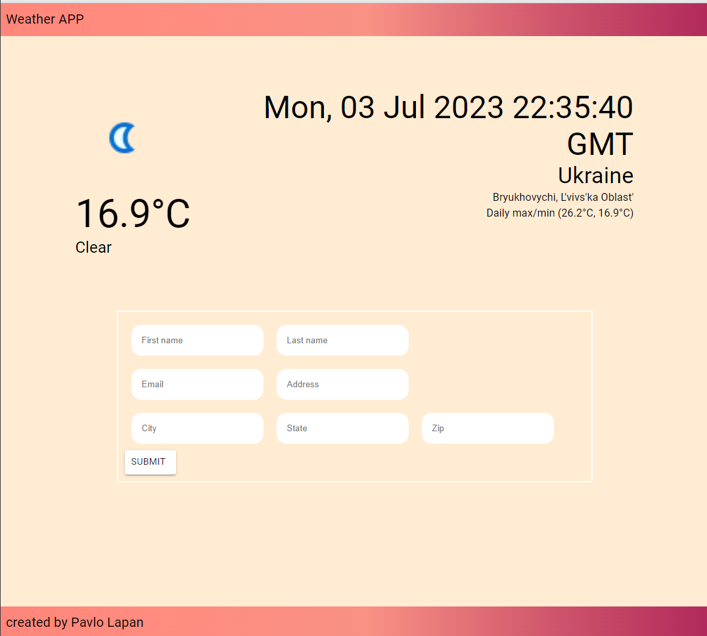

# IT-Craft coding challenge
## Settings

* Check node, need 16+ version
* get api key for getting correct data, we dont use Dummy data, can be created here - https://www.weatherapi.com
* API key need to be inserted in .env file with VITE_FETCH_API_KEY variable

# Application

# How to run: 
* Clone repo from https://github.com/PavloLapan/itCraft-weather-app
* run npm i
* run npm run dev
* project will be in  http://localhost:5174/

# TASK

Create a web application using Vite with the framework of React with Typescript with Material U.I.
The contents of the applications should load the current weather at the top using the one of the two apis below or pick your own:
Weather Forecast API | Open-Meteo.com
Free Weather API - WeatherAPI.com
Sample Url:
https://api.open-meteo.com/v1/forecast?latitude=52.52&longitude=13.41&hourly=temperature_2m

Below the current weather should be a form asking for First Name, Last Name, Email Address, Address, City, State, and Zipcode.  
Simulate a post to an api with the form contents when the submit button is pressed.
Sample Json object:
{“FirstName” : ”Marcus”, ”LastName” : ”Allen”, “Email” : ”Marcusa@sca-corp.com”, “Address” : ”123 smith st”, “City” : ”albany”, “State” : ”NY”, ”Zipcode” : ”12345”}

### Tech steck
* TS/React/Vite
* MUI(styled components, components from MUI)

###Author: Pavlo Lapan

